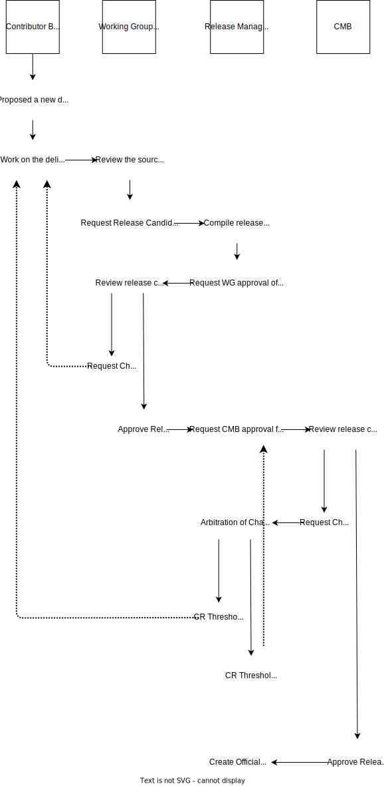

# Releases

This document is a [community guideline].

## Purpose

The document outlines the guidelines of managing releases within the Common Cloud Controls (CCC) project.

## Ownership

The [Communications WG] is responsible for setting the release roadmap and communicating project progress to the wider community. All other [WG]'s should contribute to determining the content of a release.

## Scheduling

The community aims for several releases per year. Releases can occur as soon as the controls for a service are complete and approved. As the CCC project is producing a standard, releases should encapsulate a concrete set of stable, robustly tested changes constituting a new version of the project over small isolated changes and bugfixes.

### Events

The community can align releases with events such as the [Open Source in Finance Forum (OSFF)](https://events.linuxfoundation.org/open-source-finance-forum/). These events provide excellent opportunities to showcase the project and generate interest.

## Project Board Management

To manage GitHub issues targeted for a release, we recommend using a combination of [Milestones] and labels.

### Milestones

[Milestones] group GitHub issues related to a specific release. Each release should have a single top-level milestone associated with all relevant issues.

### Labels

Each [WG] should apply their label to relevant issues, clearly indicating which issues fall under their responsibility.

Additionally, labels can flag issues specifically targeted for events (e.g., OSFF events).

## Release Process

The release process involves contributors proposing changes through a pull request, followed by reviews and validations from relevant Working Groups, the creation of a release candidate, and multiple stages of approval from the [Change Management Board] (CMB) and project contributors, culminating in the official release being published and announced to the community. The diagram below explains the entire flow at a high-level, and we expand upon this in the subsections of the flow diagram.

### Pull Request Validation

1. **Submission:** A contributor proposes a deliverable or change through a Pull Request (PR) to the CCC repository.

   - If a release manager has not been preemptively appointed for this deliverable, the [Delivery WG] should do so at this time.

2. **Working Group Review:** The relevant [WG]s will review the PR.

   - **[Security WG]** ensures all controls and threat catalogs are complete and ready for release.
   - **[Taxonomy WG]** ensures the required fields and capabilities are populated and ready for release.
   - **[Delivery WG]** ensures that the PR aligns with content development and formatting standards.

3. **Validation:** All [WG]s

### Release Candidate Preparation

1. **Request for Release Candidate (RC):** After the PR is merged, the Release Manager compiles the release candidate based on the merged changes.
2. **Working Group Approval:** The [WG]s review the release candidate to ensure all deliverables are finalized and meet release criteria. The release candidate must be approved before moving forward in the process.
3. **Change Management Board (CMB) Review:**
   - The CMB reviews the release candidate and confirms whether it adheres to compliance and quality standards.
   - If further changes are required, the Release Manager aggregates feedback and creates a loop for revisions.
4. **Prepare Official Release:** Once the CMB has approved the request, then the Release Manager will begin the promotion process for the release candidate.

### Final Release

1. **Publishing:** The Release Manager creates the official release based on the final approved release candidate. This is published on GitHub along with release notes and documentation updates.
2. **Announcement:** The [Communications WG] announces the release through appropriate channels suchs as mailing lists and social media.

[WG]: ../../governance/community-structure.md#working-groups
[Security WG]: ../../governance/working-groups/security/charter.md
[Taxonomy WG]: ../../governance/working-groups/taxonomy/charter.md
[Delivery WG]: ../../governance/working-groups/delivery/charter.md
[Change Management Board]: ./cmb.md
[Communications WG]: ../../governance/working-groups/communications/charter.md
[community guideline]: ../README.md
