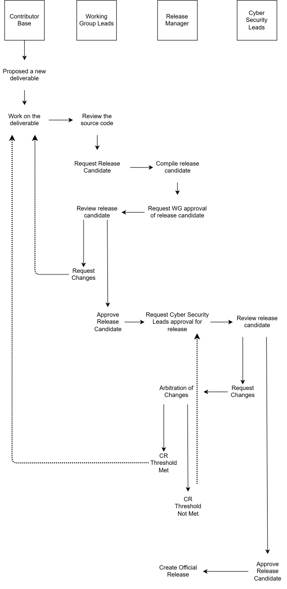

# Releases

This document is a [community guideline].

## Purpose

The document outlines the guidelines of managing releases within the Common Cloud Controls (CCC) project.

## Ownership

The [Communications WG] is responsible for setting the release roadmap and communicating project progress to the wider community. All other [WG]'s should contribute to determining the content of a release.

## Scheduling

The community aims for several releases per year. Releases can occur as soon as the controls for a service are complete and approved. As the CCC project is producing a standard, releases should encapsulate a concrete set of stable, robustly tested changes constituting a new version of the project over small isolated changes and bugfixes.

### Events

The community can align releases with events such as the [Open Source in Finance Forum (OSFF)](https://events.linuxfoundation.org/open-source-finance-forum/). These events provide excellent opportunities to showcase the project and generate interest.

## Project Board Management

To manage GitHub issues targeted for a release, we recommend using a combination of [Milestones] and labels.

### Milestones

[Milestones] group GitHub issues related to a specific release. Each release should have a single top-level milestone associated with all relevant issues.

### Labels

Each [WG] should apply their label to relevant issues, clearly indicating which issues fall under their responsibility.

Additionally, labels can flag issues specifically targeted for events (e.g., OSFF events).

## Release Process

The release process involves contributors proposing changes through a pull request, followed by reviews and validations from relevant Working Groups, the creation of a release candidate, and [sign-off](#release-sign-off) from the required approvers, culminating in the official release being published and announced to the community. The diagram below explains the entire flow at a high-level, and we expand upon this in the subsections of the flow diagram.

### Release Manager

Each release is coordinated by a Release Manager, appointed by the [Delivery WG]. The Release Manager compiles the release candidate from the merged changes, coordinates Working Group review and [sign-off](#release-sign-off), and promotes and publishes the approved release. If a Release Manager has not been appointed for a deliverable, the [Delivery WG] appoints one.

### Pull Request Validation

1. **Submission:** A contributor proposes a deliverable or change through a Pull Request (PR) to the CCC repository.
   - If a release manager has not been preemptively appointed for this deliverable, the [Delivery WG] should do so at this time.

2. **Working Group Review:** The relevant [WG]s will review the PR.
   - **[Security WG]** ensures all controls and threat catalogs are complete and ready for release.
   - **[Taxonomy WG]** ensures the required fields and capabilities are populated and ready for release.
   - **[Delivery WG]** ensures that the PR aligns with content development and formatting standards.

3. **Validation:** All [WG]s

### Release Candidate Preparation

1. **Request for Release Candidate (RC):** After the PR is merged, the Release Manager compiles the release candidate based on the merged changes.
2. **Working Group Approval:** The [WG]s review the release candidate to ensure all deliverables are finalized and meet release criteria. The release candidate must be approved before moving forward in the process.
3. **Sign-off:** The release candidate is signed off in line with [Release Sign-off](#release-sign-off) — the relevant [WG] lead plus at least one designated Cyber Security Lead, with the two sign-offs coming from two different people. If further changes are required, the Release Manager aggregates feedback and creates a loop for revisions.
4. **Prepare Official Release:** Once sign-off is complete, the Release Manager will begin the promotion process for the release candidate.

### Final Release

1. **Publishing:** The Release Manager creates the official release based on the final approved release candidate. This is published on GitHub along with release notes and documentation updates.
2. **Announcement:** The [Communications WG] announces the release through appropriate channels suchs as mailing lists and social media.

## Release Sign-off

Beyond Working Group review, the Steering Committee holds a defined, limited [release governance] role, delivered through designated **[Cyber Security Leads]**.

Every release requires sign-off from the relevant [WG] lead, plus at least one designated Cyber Security Lead. There is no separate emergency or expedited path, and no distinction between material and non-material changes — all releases go through the same requirement.

The two sign-offs must come from two different people. A [WG] lead may also be a designated Cyber Security Lead; where the relevant [WG] lead holds both roles, the Cyber Security Lead sign-off must come from a _different_ designated Cyber Security Lead, so the approver pool stays independent of the release's author.

## Roadmap Planning

The Steering Committee sets project direction on an ongoing basis. Suggestions and features are raised by the community as GitHub issues, which the committee reviews and prioritises during its regular meetings; the resulting high-level "north star" direction is communicated to the community and can be shown on the project website. See [Roadmap Planning] in the Steering Committee Charter for the full process.

[WG]: ../../governance/community-structure.md#working-groups
[Security WG]: ../../governance/working-groups/security/charter.md
[Taxonomy WG]: ../../governance/working-groups/taxonomy/charter.md
[Delivery WG]: ../../governance/working-groups/delivery/charter.md
[Communications WG]: ../../governance/working-groups/communications/charter.md
[community guideline]: ../README.md
[release governance]: ../../governance/steering/charter.md#release-governance
[Cyber Security Leads]: ../../governance/steering/charter.md#cyber-security-leads
[Roadmap Planning]: ../../governance/steering/charter.md#roadmap-planning
