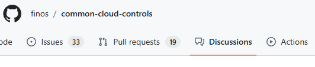
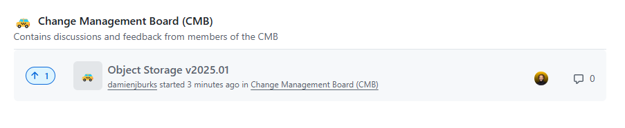
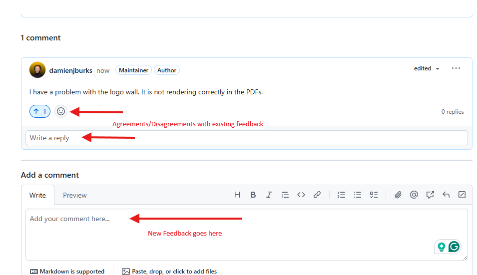

# CMB Feedback Guide

This is a simple guide for CMB members on how to properly provide feedback within GitHub Discussions.

## Steps

1. Navigate to the Discussions Section in GitHub for this project:

   

1. Find an active discussion that's associated with the release you would like to contribute to. You can find it here: [Active Discussions for CMB](https://github.com/finos/common-cloud-controls/discussions/categories/change-management-board-cmb?discussions_q=is%3Aopen+category%3A%22Change+Management+Board+%28CMB%29%22)

   

1. If your issue is unique, please create a new thread in the discussion post by leaving a comment. Otherwise, feel free to leave a comment inside of the thread on the discussion.

   

1. Double check to ensure you put your comment in the right place before hitting the green button!
