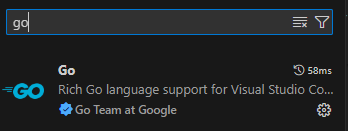

# Delivery Toolkit - User Guide

Welcome to the user guide for the Delivery Toolkit, a robust solution developed with Go, GitHub Actions, and GitHub Releases. The toolkit's primary purpose is to automate the creation and compilation of artifacts for public release.

## Overview

The Delivery Toolkit comprises multiple Go files, each tailored to specific tasks like generating release notes, updating metadata, and producing PDF and Markdown artifacts. Below is a brief description of each file:

1. **`catalog-compiler.go`**  
   Compiles YAML-based controls, features, threats, and metadata into a unified catalog with autogenerated links.

1. **`gen-markdown.go`**  
   Generates a styled omnibus Markdown file by compiling YAML-based data and rendering it using customizable templates.

1. **`gen-release-notes.go`**  
   Produces release notes by compiling YAML-based catalog data and rendering them through customizable Markdown templates.

1. **`gen-yaml.go`**  
   Compiles catalog data into a YAML file and saves it in a specified output directory.

1. **`update-metadata.go`**  
   Updates metadata YAML files with commit history, contributors, and changelog details by leveraging the GitHub API.

1. **`utils.go`**  
   Contains utility functions shared across the other files to streamline development and functionality.

## Local Setup and Configuration

### Prerequisites

To contribute to this project, ensure you have the following tools installed:

1. [**Golang**](https://go.dev/doc/install) - The primary programming language used.
1. [**VS Code**](https://code.visualstudio.com/download) - A powerful code editor.
1. [**Git**](https://git-scm.com/downloads) - For version control and repository management.
1. [**Docker**](https://docs.docker.com/engine/install/) - Used for PDF creation and generation.

Once installed, open VS Code and add the following extension:

- **Go VS Code Extension**: [Install here](https://marketplace.visualstudio.com/items?itemName=golang.go)  
   

### Installing Dependencies

1. Open VS Code.
1. Clone the repository locally using Git. If you're unfamiliar with Git cloning, refer to this helpful guide: [How to Git Clone](https://www.geeksforgeeks.org/how-to-git-clone-a-remote-repository/).
1. Open a terminal or shell in VS Code, navigate to the project directory, and run the following command:

   ```bash
   cd delivery-toolkit
   go get # Installs all required dependencies
   ```

1. Once all dependencies are installed, run this command to confirm the setup:

   ```bash
   go run .

   # Output Example
   ----------------------------------------
        _______________
       / ___/ ___/ ___/
      / /  / /  / /
     / /__/ /__/ /___
     \____/____/____/

   ----------------------------------------

   Welcome to the CCC Delivery Toolkit CLI v0.0.0-dev

   You appear to be exploring!
   We suggest you begin by running the 'help' command via -h to review the available options.

   ----------------------------------------
   ```

1. Set up the Docker container for PDF generation by pulling the required image:

   ```bash
   docker pull jmaupetit/md2pdf
   ```

## Testing Locally

To generate artifacts and test commands locally for Object Storage specifically (as an example), use the following commands:

- **Generating an Omnibus MD File**

  ```bash
  go run . "md" -t ..\services\storage\object\

  # Output Example
  ----------------------------------------
       _______________
      / ___/ ___/ ___/
     / /  / /  / /
    / /__/ /__/ /___
    \____/____/____/

  ----------------------------------------

  File generated successfully: artifacts\CCC.ObjStor_2025.01.md

  ----------------------------------------
  ```

- **Generating a YAML File**

  ```bash
  go run . "yaml" -t ..\services\storage\object\

  # Output Example
  ----------------------------------------
       _______________
      / ___/ ___/ ___/
     / /  / /  / /
    / /__/ /__/ /___
    \____/____/____/

  ----------------------------------------

  File generated successfully: ./artifacts/CCC.ObjStor_2025.01.yaml

  ----------------------------------------
  ```

- **Generating Release Notes**

  ```bash
  go run . "release-notes" -t ..\services\storage\object\

  # Output Example
  ----------------------------------------
       _______________
      / ___/ ___/ ___/
     / /  / /  / /
    / /__/ /__/ /___
    \____/____/____/

  ----------------------------------------

  File generated successfully: artifacts\release_notes.md

  ----------------------------------------
  ```

- **Updating Metadata**

  ```bash
  go run . "update-metadata" -t ..\services\storage\object\

  # Output Example
  ----------------------------------------
       _______________
      / ___/ ___/ ___/
     / /  / /  / /
    / /__/ /__/ /___
    \____/____/____/

  ----------------------------------------

  Contributors and Change Log has been updated.
  Metadata has been updated successfully: ..\services\storage\object\metadata.yaml

  ----------------------------------------
  ```

  **NOTE:** This command should only be used when preparing for a release, as it modifies the `metadata.yaml` files for a given service.

## Triggering Pipelines

TBD/WIP!
