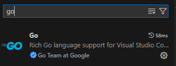
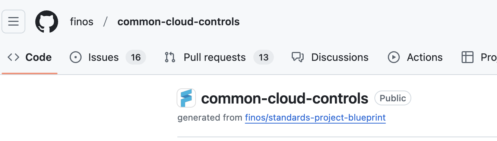

# Delivery Toolkit - User Guide

Welcome to the **Delivery Toolkit** user guide—a powerful solution built with Go, GitHub Actions, and GitHub Releases to automate the creation and compilation of artifacts for public release.

Before contributing to the codebase, we highly recommend reviewing the [Releases] documentation. The development process is aligned with the strategies outlined there, ensuring consistency and quality across all contributions.

## Overview

The Delivery Toolkit consists of several Go files, each serving a specific purpose in the release process. Below is an overview of these files:

1. **`catalog-compiler.go`**  
   Compiles YAML-based controls, capabilities, threats, and metadata into a unified catalog with autogenerated links.

2. **`gen-markdown.go`**  
   Generates a styled omnibus Markdown file by compiling YAML-based data and rendering it with customizable templates.

3. **`gen-release-notes.go`**  
   Produces release notes by compiling catalog data and rendering them into Markdown via customizable templates.

4. **`gen-yaml.go`**  
   Converts catalog data into a YAML file and saves it in the specified output directory.

5. **`compile.go`**  
   Compiles one catalog asset (capabilities, threats, or controls) into a single self-describing Gemara artifact, ready for validation and publishing via grcli.

6. **`utils.go`**  
   Provides shared utility functions to streamline development across the toolkit.

## Local Setup and Configuration

### Prerequisites

Before you begin, ensure the following tools are installed:

1. [**Golang**](https://go.dev/doc/install) - The primary language of the project.
2. [**VS Code**](https://code.visualstudio.com/download) - A versatile code editor.
3. [**Git**](https://git-scm.com/downloads) - For version control and repository management.
4. [**Docker**](https://docs.docker.com/engine/install/) - Used for PDF generation.

Additionally, install the **Go VS Code Extension** for a better development experience:
[Install here](https://marketplace.visualstudio.com/items?itemName=golang.go).  


### Installing Dependencies

1. Clone the repository locally:

   ```bash
   git clone <repository-url>
   ```

   If you're new to Git, follow this guide: [How to Git Clone](https://www.geeksforgeeks.org/how-to-git-clone-a-remote-repository/).

2. Open the repository in VS Code and run the following commands in the terminal:

   ```bash
   cd delivery-toolkit
   go get # Install required dependencies
   ```

3. Verify the setup:

   ```bash
   go run .
   ```

   **Expected Output**:

   ```bash
   ----------------------------------------
        _______________
       / ___/ ___/ ___/
      / /  / /  / /
     / /__/ /__/ /___
     \____/____/____/

   ----------------------------------------

   Welcome to the CCC Delivery Toolkit CLI v0.0.0-dev
   Use the 'help' command (-h) to explore available options.
   ----------------------------------------
   ```

4. Pull the Docker image required for PDF generation:

   ```bash
   docker pull jmaupetit/md2pdf
   ```

## Testing Locally

Here are some example commands for testing the toolkit locally:

- **Generate an Omnibus Markdown File**

  ```bash
  go run . "md" -t ../catalogs/storage/object/
  ```

  **Output Example**:

  ```text
  File generated successfully: artifacts/CCC.ObjStor_2025.01.md
  ```

- **Generate a YAML File**

  ```bash
  go run . "yaml" -t ../catalogs/storage/object/
  ```

  **Output Example**:

  ```text
  File generated successfully: ./artifacts/CCC.ObjStor_2025.01.yaml
  ```

- **Generate Release Notes**

  ```bash
  go run . "release-notes" -t ../catalogs/storage/object/
  ```

  **Output Example**:

  ```text
  File generated successfully: artifacts/release_notes.md
  ```

- **Compile a Catalog Asset**

  ```bash
  go run . compile --build-target storage/object --type capabilities --version v2026.04 --output-dir artifacts
  ```

  **Output Example**:

  ```text
  compiled storage/object/capabilities -> artifacts/storage/object/capabilities.yaml
  ```

  > **NOTE**: `--output-dir` defaults to the current directory, so without it the
  > artifact lands at `storage/object/capabilities.yaml`. Swap `--type` for
  > `threats` or `controls` to compile those catalogs.
  >
  > **NOTE**: Produces a single self-describing Gemara artifact ready for `grcli validate` / `grcli publish`.

## Triggering the Artifact Pipeline

The Artifact Pipeline is the backbone of the Delivery Toolkit, leveraging GitHub Actions to:

- Compile a single typed catalog asset from version-controlled source.
- Validate it against the Gemara spec and publish it to grc.store.
- Cut a GitHub release carrying the same artifact.

### Steps to Execute

1. Log in to GitHub and navigate to the `common-cloud-controls` repository.
2. Click **Actions** in the repository menu.  
   
3. Select the **Release Catalog** workflow on the left-hand side.
4. Click **Run workflow** and supply the inputs:
   - **build_target** — the catalog to release as `family/service` (e.g. `storage/object`).
   - **asset_type** — `capabilities`, `threats`, or `controls`.
   - **version** — the release version stamped into the artifact (e.g. `v2026.04`, or `v2026.04-rc1` for a release candidate).
   - **dry_run** — optional; compile + validate + build the bundle without publishing to grc.store or cutting a GitHub release.

   > **Note**: The process may take a few minutes to complete. A `version` containing `rc` is automatically published as a prerelease — there is no manual tag editing step.

5. Verify the release under [Common Cloud Controls Releases](https://github.com/finos/common-cloud-controls/releases) and ensure it aligns with the [Release Guidelines](../../../community-guidelines/content-standards-and-practices/release-assets.md).
