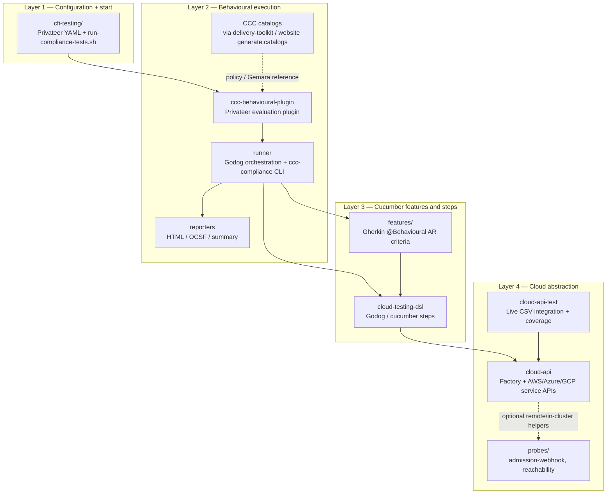

# Go modules

All Go code for CCC cloud testing lives under this directory (plus `cfi-testing/` and `delivery-toolkit/` at the repo root). Layers run top-down: config starts a Privateer behavioural run, which loads Cucumber features/steps and drives the cloud abstraction layer.

## Architecture



| Layer | Path(s) | Purpose |
| ----- | ------- | ------- |
| **1 — Configuration + start** | [`cfi-testing/`](../cfi-testing/) | Privateer service configs and `run-compliance-tests.sh` — the entrypoint that builds/installs the plugin and invokes `pvtr`. |
| **2 — Behavioural execution** | [`ccc-behavioural-plugin/`](ccc-behavioural-plugin/), [`runner/`](runner/), [`reporters/`](reporters/) | Privateer plugin + Godog orchestration. Needs CCC catalogs (produced by [`delivery-toolkit/`](../delivery-toolkit/) / `website` catalog generation) to evaluate controls. Pass/fail here is about **controls**. |
| **3 — Cucumber features and steps** | [`features/`](features/), [`cloud-testing-dsl/`](cloud-testing-dsl/) | Gherkin AR criteria and the Godog steps that bind those phrases to `cloud-api` calls. |
| **4 — Cloud abstraction** | [`cloud-api/`](cloud-api/), [`cloud-api-test/`](cloud-api-test/), [`probes/`](probes/) | Shared provider APIs (EKS/AKS/GKE, S3, VMs, …) plus optional probe helpers. Behavioural steps and CSV integration both invoke this surface; `cloud-api-test` proves **our** driver code, not AR compliance. |

## Workspace

[`go.work`](go.work) links the modules for local development. CI uses the same workspace via [`.github/actions/setup-go-workspace`](../.github/actions/setup-go-workspace/action.yml) (`go-version-file: modules/go.work`, `GOWORK` enabled).

| Path | README |
| ---- | ------ |
| [`cloud-api/`](cloud-api/) | [README](cloud-api/README.md) — provider APIs, factory, types |
| [`cloud-api-test/`](cloud-api-test/) | [README](cloud-api-test/README.md) — live integration + coverage |
| [`features/`](features/) | [README](features/README.md) — Gherkin layout and routing |
| [`runner/`](runner/) | [README](runner/README.md) — behavioural runner library / CLI |
| [`ccc-behavioural-plugin/`](ccc-behavioural-plugin/) | [README](ccc-behavioural-plugin/README.md) — Privateer plugin |
| [`cloud-testing-dsl/`](cloud-testing-dsl/) | [README](cloud-testing-dsl/README.md) — Godog cloud steps |
| [`reporters/`](reporters/) | [README](reporters/README.md) — HTML / OCSF / summary |
| [`probes/`](probes/) | [README](probes/README.md) — admission-webhook, reachability |
| [`../delivery-toolkit/`](../delivery-toolkit/) | Catalog compile CLI (in `go.work`; used by website / release) |

Build everything:

```bash
./modules/build.sh
```

Or run behavioural compliance tests (builds the workspace automatically):

```bash
../cfi-testing/run-compliance-tests.sh -S <privateer-service> ...
```

For live `cloud-api` integration (fixtures + CSV), see [`cloud-api-test/README.md`](cloud-api-test/README.md).
