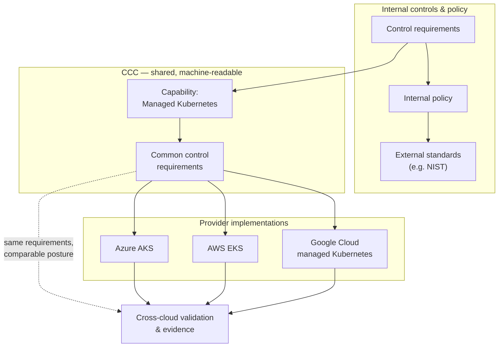

import ContentPage from '@site/src/components/ContentPage';
import YouTubeEmbed from '@site/src/components/YouTubeEmbed';
import PullQuote from '@site/src/components/PullQuote';

<ContentPage subtitle="Case Study" title="Morgan Stanley: Consistent managed Kubernetes controls across clouds" toc={toc}>

<YouTubeEmbed
  url="https://www.youtube.com/watch?v=NHvf31wJ2Ig"
  caption="Dave Reeve (Morgan Stanley) on FINOS Common Cloud Controls"
/>

## The challenge

Morgan Stanley defines internal controls for cloud services and maps them to internal policy and external standards. Engineers then use those requirements to build services such as managed Kubernetes clusters. Dave Reeve explained that a control spreadsheet does not, by itself:

* Show whether the resulting deployment meets the controls
* Give the firm a clear chain of evidence for a regulator

The difficulty grows across cloud providers. Reeve described separate implementations developed by different engineers:

* Azure AKS
* AWS EKS
* Google Cloud managed Kubernetes

An earlier version of the work had three control tables that did not match. Morgan Stanley needs to compare security posture across those services and understand where a provider's features may not meet a requirement.

## Why Morgan Stanley is involved in CCC

Reeve wants common, machine-readable control requirements that can be linked to deployment patterns and validated against what is built. He said Morgan Stanley had Terraform examples for managed Kubernetes on the three clouds, and intended to open source them and contribute the associated requirements to CCC.

<PullQuote attribution="— Dave Reeve, Morgan Stanley">
  If Morgan Stanley has this problem, I guarantee every other financial services organization is going to have exactly the same problem.
</PullQuote>

Sharing the implementation and requirements could also give cloud providers a concrete example when a feature behaves differently or appears not to satisfy a control. Reeve argued that financial firms face similar problems independently and that a shared approach would make requirements more consistent for engineers, providers and regulators. Internally, he said colleagues had been receptive to CCC and validation because of the value of a reusable mapping from policy to evidence and checks of deployed systems. These are expected benefits, not measured results from the presentation.

On the regulatory side, Reeve said evidence should be tied to established industry standards. At the time of the talk, the presenters had yet to establish the right engagement with regulators and assessors who would consume that evidence.

## Implementation status and constraint

Morgan Stanley was working through how to express its existing controls in CCC terms — translating internal policy language into CCC's format while deciding what internal detail could be published. Its internal controls already map through internal policy and requirements to standards such as NIST; publishing a useful mapping requires care because some of that detail cannot simply be made public. 

The managed Kubernetes capabilities, threats, and controls are now published in the [CCC Kubernetes catalog](/catalogs/orchestration/k8s).

*Source: [Morgan Stanley presentation on YouTube](https://www.youtube.com/watch?v=NHvf31wJ2Ig).*

</ContentPage>
