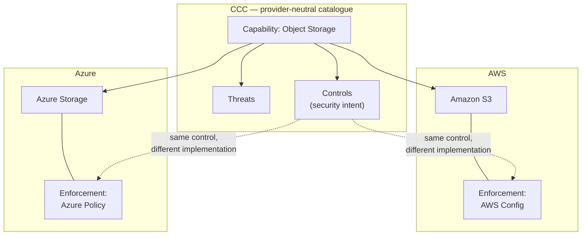

import ContentPage from '@site/src/components/ContentPage';
import YouTubeEmbed from '@site/src/components/YouTubeEmbed';
import PullQuote from '@site/src/components/PullQuote';

<ContentPage subtitle="Case Study" title="RBC: A shared language for cloud security controls" toc={toc}>

<YouTubeEmbed
  url="https://www.youtube.com/watch?v=rZZGisQBzcQ"
  caption="Eddie Knight (Revanite) and Maxime Coquerel (RBC) on FINOS Common Cloud Controls"
/>

## The challenge

Maxime Coquerel, a principal cloud security architect at RBC, described the bank's review process for cloud deployment patterns. The team:

* Reviews individual cloud services and documents their threats, needed controls, and mappings to existing controls
* Works with application and platform teams on threat modelling
* Validates cloud controls
* Conducts penetration testing
* Feeds findings into a risk scorecard considered by a cloud governance board before production approval

Consistency is difficult across providers. An objective such as encryption in transit must be implemented through different mechanisms, including Azure Policy and AWS Config. Those differences can leave gaps when teams translate the same security intent into provider specific policies.

## Where CCC fits

Coquerel presented CCC as a provider neutral catalogue of capabilities, threats and controls. An object storage capability, for example, can be described once for both Amazon S3 and Azure Storage, while the specific enforcement policy differs by provider. This gives RBC a common starting point for assessing services and a way to distinguish a security control from its implementation.

<PullQuote attribution="— Maxime Coquerel, Principal Cloud Security Architect, RBC">
  CCC is a cross-cloud shared language — you define your control in one language, and that is applicable for all your cloud providers.
</PullQuote>

He said that existing CCC catalogues could help a team begin a new service review without defining every capability, threat and control from scratch. He also pointed to reference Terraform modules and security tool integrations as ways for organisations to build on the catalogue — modules that, at the time of the talk, lived in FINOS Labs for testing, with a shared library as an objective. Coquerel encouraged organisations that consume those modules to contribute their own.

His stated goal was a shared language that improves standardisation and compliance work across clouds. Keeping that language current with regulatory change depends on community contributions: CCC versions its catalogues and records the version of each external document used in a mapping, so users can identify mappings that may need reassessment after an update.

*Source: [RBC presentation on YouTube](https://www.youtube.com/watch?v=rZZGisQBzcQ).*

</ContentPage>
