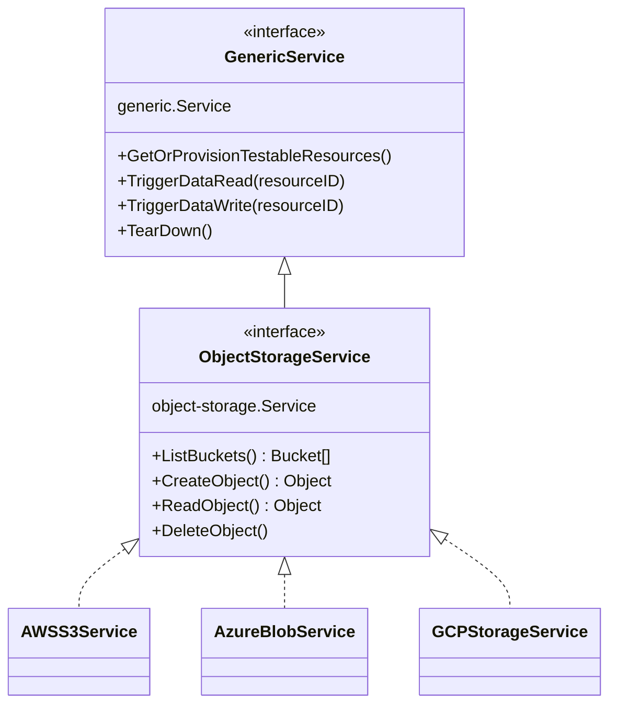

import ContentPage from '@site/src/components/ContentPage';

<ContentPage subtitle="Automated compliance for cloud controls" title="Validators">

CCC control catalogs define assessment requirements that can be translated into automated validators. Open-source validators are being developed by the [Compliant Financial Infrastructure](https://github.com/finos-labs/ccc-cfi-compliance) project to continuously measure deployed infrastructure against those expectations.

Not every control can be verified the same way. Some assessment requirements are best checked by inspecting configuration — the same class of evidence a Cloud Security Posture Management (CSPM) tool would collect. Others require behavioural validation: exercising the service to confirm that protections hold under real use, not just on paper.

In the CFI compliance test suite, these approaches are tagged as `@Policy` and `@Behavioural` respectively. Most mature governance programmes use both: CSPM-style scans for breadth and behavioural tests for depth where configuration alone is insufficient.

### CSPM validation vs behavioural validation

| Dimension | CSPM validation | Behavioural validation |
| --- | --- | --- |
| **What it checks** | Static configuration and policy settings on cloud resources | Runtime behaviour and observable outcomes when a service is used |
| **How it works** | Queries cloud APIs or configuration stores to compare declared settings against expected rules | Executes real API calls, network probes, or test actions against live or sandbox environments |
| **When it runs** | Continuously or on a schedule as part of configuration scanning pipelines | During CI/CD, pre-deployment gates, or on-demand compliance test runs |
| **Strengths** | Fast, broad coverage across many resources with low operational risk | Confirms controls actually work in practice, not just that they are configured |
| **Limitations** | May miss effective permissions, indirect misconfigurations, or settings that drift after deployment | Slower to run, may require dedicated test resources, and can have higher operational cost |
| **Example** | Verify an object storage bucket has encryption-at-rest enabled in its policy | Attempt an unauthorized read against the bucket and confirm access is denied |

### CSPM Validation Tools

The CCC project recognises that many excellent existing CSPM tools exist.  We are exploring integrations with Azure Policy, Prowler and Privateer, which you can read about further on the [Ecosystem page.](/ecosystem)

### Behavioural Validation in CCC

Rather than inspecting configuration alone, behavioural tests discover live cloud resources and exercise them through a layered testing stack: 
 - a provider-agnostic API abstraction, 
 - a shared FINOS integration environment, 
 - reusable Cucumber steps, 
 - Gherkin feature files mapped to assessment requirements
 - Privateer Gemara output formand published results on this website.

#### Cloud API Abstraction.

Tests do not call provider SDKs directly from feature files. 

Instead, the `cloud-api` Go module exposes a factory-based service API and provider-specific implementations provide common functionality for each platform.

In the case of object storage (see diagram below), the same Gherkin scenario can therefore run against S3, Azure Blob Storage, or GCS without rewriting the test logic.



#### FINOS Integration Environment

Behavioural tests run against real infrastructure, not mocks. The CCC project maintains a shared integration environment and CI pipelines and local runs target this environment so every `@Behavioural` scenario validates actual runtime behaviour in a FINOS-operated cloud account.

<div style={{ display: "flex", gap: "1rem", flexWrap: "wrap", marginTop: "1.5rem", marginBottom: "1.5rem", alignItems: "flex-start" }}>
  <figure style={{ flex: "1 1 0", minWidth: "180px", margin: 0, textAlign: "center" }}>
    
    <figcaption style={{ marginTop: "0.5rem", fontSize: "0.875rem", color: "var(--gf-color-text-subtle)" }}>AWS</figcaption>
  </figure>
  <figure style={{ flex: "1 1 0", minWidth: "180px", margin: 0, textAlign: "center" }}>
    
    <figcaption style={{ marginTop: "0.5rem", fontSize: "0.875rem", color: "var(--gf-color-text-subtle)" }}>Azure</figcaption>
  </figure>
  <figure style={{ flex: "1 1 0", minWidth: "180px", margin: 0, textAlign: "center" }}>
    
    <figcaption style={{ marginTop: "0.5rem", fontSize: "0.875rem", color: "var(--gf-color-text-subtle)" }}>GCP</figcaption>
  </figure>
</div>

#### Cucumber Standard Steps

Generic test mechanics — calling methods, asserting on results, resolving variables between steps — are provided by the open-source [standard-cucumber-steps](https://github.com/robmoffat/standard-cucumber-steps) library.   This obviates the need for most CCC-specific behavioural steps and simplifies test writing to the point that it can be automated by AI tools.

<div style={{ display: "flex", gap: "1rem", flexWrap: "wrap", marginTop: "1.5rem", marginBottom: "1.5rem", alignItems: "flex-start" }}>
  <figure style={{ flex: "1 1 0", minWidth: "180px", margin: 0, textAlign: "center" }}>
    
    <figcaption style={{ marginTop: "0.5rem", fontSize: "0.875rem", color: "var(--gf-color-text-subtle)" }}>Standard Cucumber Steps</figcaption>
  </figure>
  <figure style={{ flex: "1 1 0", minWidth: "180px", margin: 0, textAlign: "center" }}>
    
    <figcaption style={{ marginTop: "0.5rem", fontSize: "0.875rem", color: "var(--gf-color-text-subtle)" }}>Test Steps Documentation</figcaption>
  </figure>
</div>

#### Per-Assessment Requirement Feature files

Each CCC assessment requirement maps to a Gherkin feature file as a cloud agnostic test.  For example: 

```
@Behavioural
  Scenario: Service prevents reading bucket with no access
    And I call "{api}" with "GetServiceAPIWithIdentity" using arguments "object-storage" and "test-user-no-access"
    And "{result}" is not an error
    And I refer to "{result}" as "userStorage"
    When I call "{userStorage}" with "ListObjects" using argument "{resource-name}"
    Then "{result}" is an error
    And I attach "{result}" to the test output as "no-access-list-error.txt"
```

#### Test Result Formats

Compliance runs produce HTML, [OCSF](https://schema.ocsf.io/) and [Gemara](https://gemara.openssf.org)-formatted reports.

<div style={{ display: "flex", gap: "1rem", flexWrap: "wrap", marginTop: "1.5rem", marginBottom: "1.5rem", alignItems: "flex-start" }}>
  <figure style={{ flex: "1 1 0", minWidth: "180px", margin: 0, textAlign: "center" }}>
    
    <figcaption style={{ marginTop: "0.5rem", fontSize: "0.875rem", color: "var(--gf-color-text-subtle)" }}>Compliance summary</figcaption>
  </figure>
  <figure style={{ flex: "1 1 0", minWidth: "180px", margin: 0, textAlign: "center" }}>
    
    <figcaption style={{ marginTop: "0.5rem", fontSize: "0.875rem", color: "var(--gf-color-text-subtle)" }}>OCSF report</figcaption>
  </figure>
  <figure style={{ flex: "1 1 0", minWidth: "180px", margin: 0, textAlign: "center" }}>
    
    <figcaption style={{ marginTop: "0.5rem", fontSize: "0.875rem", color: "var(--gf-color-text-subtle)" }}>HTML scenario report</figcaption>
  </figure>
</div>


#### Results On the CCC Website

You can see results from sample infrastructure runs [here](/cfi).

### Running the Validators Yourself

Please see [the `cfi-testing README`](https://github.com/finos/common-cloud-controls/tree/main/cfi-testing)
</ContentPage>

